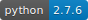

================================

CI-Status ```master```: [](https://travis-ci.org/ipa-fmw/atf)

CI-Status ```stable```: [](https://travis-ci.org/ipa-fmw/atf)

CI-Status ```atf_test_apps/master```: [](https://travis-ci.org/ipa-fmw/atf_test_apps)

[](https://github.com/ipa-flg-ma/atf_nav_pkgs)
[](https://github.com/ipa-flg-ma/atf)


The ATF is a testing framework written for [ROS](http://www.ros.org/) which supports executing integration and system tests, running benchmarks and monitor the code behaviour over time. The ATF provides basic building blocks for easy integration of the tests into your application. Furthermore the ATF provides everything to automate the execution and analysis of tests as well as a graphical web-based frontend to visualize the results.

### Architecture
###### Overview
###### Recording data
###### Analysing metrics
###### Visualising results
### Implemented metrics
The following metrics have been implemented so far:

| Metric        | Description   | Unit  | Mode (span, snap, min/max) |
|:-------------:|:--------------|:-----:|:--------------------------:|
| ```time```    | The ```time``` metric measures the elapsed time. | [sec] | span |
| ```path_length```      | The ```path_length``` metric measures the cartesian path (distance integrated over time) of a TF frame with respect to another frame.    |  [m] | span |
| ```publish_rate``` | The ```publish_rate``` metric measures the publising rate of a topic   | [1/sec] | span |
| ```api``` | The ```api``` metric checks if an interfaces (nodes, publishers, subscribers, service servers, action servers) matches its specification. | [bool] | snap |

Further metrics (in development):

| Metric        | Description   | Unit  | Mode (span, snap, min/max) |
|:-------------:|:--------------|:-----:|:--------------------------:|
| ```resources```    | The ```resources``` metric measures the resource consumption of a node on the operating system level (CPU, RAM, IO). | [%], [MB], [MB/sec] | snap |
| ```path_velocity```      | The ```path_velocity``` metric measures the cartesian velocity (distance differntiated over time) of a TF frame with respect to another frame.    |  [m/sec] | span |
| ```distance```      | The ```distance``` metric measures the cartesian distance between two TF frames.    |  [m] | snap, min/max |
| ```obstacle_distance``` | The ```obstacle_distance``` metric measures the distance between two meshes   | [m] | snap, min/max |
| ```message_match``` | The ```message_match``` metric checks if a message content matches its desired content. | [bool] | snap |

### Installation
For installation instruction see [ATF Installation](https://gitlab.cc-asp.fraunhofer.de/flg-ma/atf/blob/master/doc/Installation.md).

### Using the ATF (by examples)
For examples how to use the ATF see [ATF Examples](https://gitlab.cc-asp.fraunhofer.de/flg-ma/atf/blob/master/doc/Examples.md)

### Contributing to the ATF
For examples how to extend the ATF with your own contribution see [ATF Contribution](https://gitlab.cc-asp.fraunhofer.de/flg-ma/atf/blob/master/doc/Contribution.md)

### Acknowledgments
The work leading to these results has received funding from the European Community's Seventh Framework Program (FP7/2007-2013) under grant agreement no 609206 [Factory-in-a-Day](http://www.factory-in-a-day.eu/) and the German Federal Ministry for Economic Affairs and Energy under grant agreement no 01MA13001A [ReApp](http://www.reapp-projekt.de/).
